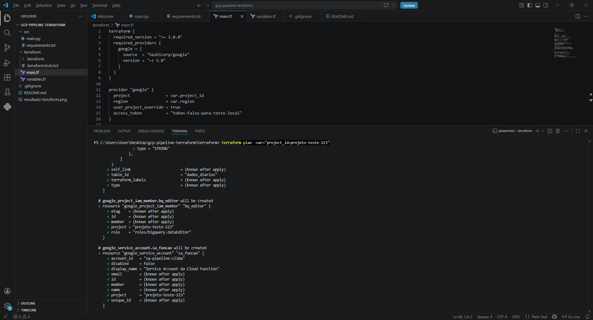

# ☁️ Pipeline de Dados Serverless com GCP e IaC (Terraform)

Este projeto demonstra a arquitetura e a automação de um pipeline de engenharia de dados focado em boas práticas de mercado, utilizando **Infraestrutura como Código (IaC)**.

## 🏗️ Arquitetura Proposta

1. **Cloud Function (Python):** Script resiliente com logs estruturados e tratamento de exceções robusto.
2. **BigQuery:** Data Warehouse para armazenamento dos dados estruturados.
3. **IAM (Segurança):** Service Account exclusiva com a permissão mínima necessária (`roles/bigquery.dataEditor`).

## 🛠️ Tecnologias
* Python 3.10
* Terraform (IaC)
* Google Cloud Platform (GCP)

## 🚀 Validação da Infraestrutura

A integridade do código do Terraform e os schemas das tabelas foram validados localmente utilizando o simulador do Terraform.

```bash
cd terraform
terraform init
terraform plan -var="project_id=projeto-teste-123"
``` 

